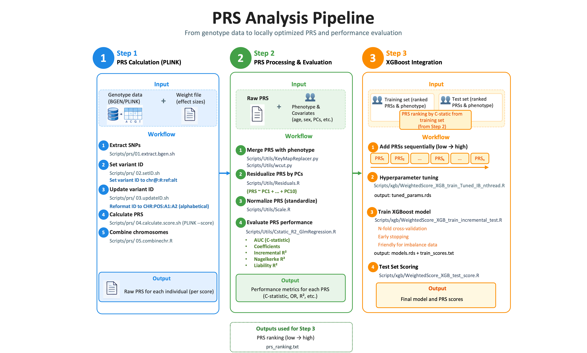

# PRS Analysis Pipeline

From genotype data to locally optimized PRS and performance evaluation.



---

## Table of Contents

1. [Overview](#overview)
2. [Repository Structure](#repository-structure)
3. [Dependencies](#dependencies)
4. [Step 1: PRS Calculation (PLINK)](#step-1-prs-calculation-plink)
5. [Step 2: PRS Processing and Evaluation](#step-2-prs-processing-and-evaluation)
6. [Step 3: XGBoost Integration](#step-3-xgboost-integration)

---

## Overview

This pipeline takes genotype data and Polygenic Risk Scores (PRS) effect sizes as input, computes per-individual PRS, evaluates their performance, and combines multiple PRS into an optimized prediction model using XGBoost.

The pipeline is organized into three steps:

- **Step 1**: Calculate raw PRS from genotype data (BGEN/PLINK) using effect size weight files
- **Step 2**: Merge PRS with phenotype and covariates, residualize by PCs, normalize, and evaluate performance (AUC, OR, R²)
- **Step 3**: Combine multiple PRS sequentially using XGBoost, with hyperparameter tuning and incremental feature addition

**Key design choices:**

- **SUM not AVG scoring**: per-chromosome scores are summed to avoid biasing cross-chromosome aggregation
- **Imbalance-aware XGBoost**: `scale_pos_weight` auto-set from class counts; PR-AUC used as the primary tuning criterion
- **Incremental feature inclusion**: XGBoost models trained with PRS added sequentially from lowest to highest C-statistic (ranked in Step 2), making the performance gain per feature directly observable
- **Stratified cross-validation**: folds preserve class proportions, safe for highly imbalanced disease datasets
- **stdin/stdout interface**: all R and Python scripts read from stdin and write to stdout, composable with pipes and HPC schedulers

---

## Repository Structure

```
PRS_cal_pipeline/
├── README.md
├── docs/
│   └── pipeline_overview.png                # Pipeline diagram
├── Scripts/
│   ├── prs/
│   │   ├── 01.extract.bgen.sh               # Extract SNPs (supports UKB and MGB)
│   │   ├── 02.setID.sh                      # Set variant ID to chr@:#:ref:alt
│   │   ├── 03.updateID.sh                   # Reformat ID to CHR:POS:A1:A2 (alphabetical)
│   │   ├── 04.calculate.score.sh            # Per-chromosome PRS scoring with plink2
│   │   └── 05.combinechr.R                  # Combine per-chromosome scores
│   ├── Utils/
│   │   ├── KeyMapReplacer.py                # Join two files on a key column
│   │   ├── wcut.py                          # Select columns by name or index
│   │   ├── Residuals.R                      # Regress PRS on PCs, extract residuals
│   │   ├── Scale.R                          # Normalize a column (z-score)
│   │   └── Cstatic_R2_GlmRegression.R       # AUC, OR, incremental R², Nagelkerke R², Liability R²
│   └── xgb/
│       ├── WeightedScore_XGB_train_Tuned_IB_nthread.R   # XGBoost hyperparameter tuning
│       ├── WeightedScore_XGB_train_incremental_test.R   # Incremental XGBoost training
│       └── WeightedScore_XGB_test_score.R               # Apply models to test set
├── workflow/
│   ├── step1.UKB.score.sh                        # Full step1 PRS Calculation (PLINK) example run for UK Biobank
│   ├── step1.MGB.score.sh                        # Full step1 PRS Calculation (PLINK) example run for MGB
│   └── run_xgb.sh                           # XGBoost stage example
├── example/
    └── example.weight.txt                   # Example weight file format

```

---

## Dependencies

### Tools

| Tool | Purpose |
|---|---|
| `plink2` | PRS calculation, variant filtering |
| `Python >= 3.7` | Utility scripts |
| `R >= 4.0` | Scoring, regression, XGBoost |

### R packages

```r
install.packages(c("docopt", "data.table", "xgboost", "glmnet"))
```

---

## Step 1: PRS Calculation (PLINK)

**Input**: Genotype data (BGEN format) + Weight file (effect sizes)

**Output**: Raw PRS for each individual (per score)

### Weight file format

All weight files must have the following columns (see `example/example.weight.txt`):

```
SNP             Chr   Pos       effect_allele   other_allele   effect_weight
1:10000:A:C     1     10000     A               C              0.0031
1:20000:G:T     1     20000     G               T             -0.0012
```

> **Important**: the SNP ID format is `CHR:POS:A1:A2` where A1 and A2 are **alphabetically ordered**, regardless of which allele is the effect allele.

---

### 1.1. Extract SNPs

Extracts only the SNPs present in the weight file from the full genotype data, dramatically reducing compute time especially when calculating multiple scores from the same genotype data.

[`Scripts/prs/01.extract.bgen.sh`](https://github.com/suiyangsun/PRS_XGBoost_pipeline/blob/main/Scripts/prs/01.extract.bgen.sh)

A single script handles both ref-first and ref-last format via the optional `[ref]` argument:

```bash
bash Scripts/prs/01.extract.bgen.sh <plink2> <bgen> <sample> <bed_file> <output_prefix> [ref-first|ref-last]
```

| Argument | Description |
|---|---|
| `<plink2>` | Path to plink2 executable |
| `<bgen>` | Path to BGEN file |
| `<sample>` | Path to sample file |
| `<bed_file>` | Path to BED format file (chr start end) containing SNP regions |
| `<output_prefix>` | Output prefix |
| `[ref]` | BGEN ref allele convention: `ref-last` (for most genotype file generated by Plink, **default**) or `ref-first` (such as UKB imputation) |

```bash
# For Most genotype data generated by Plink: ref-last is the default, $6 can be omitted
bash Scripts/prs/01.extract.bgen.sh $plink $bgen $sample $bedfile $out

# When BGEN file is ref-first, pass ref-first explicitly
bash Scripts/prs/01.extract.bgen.sh $plink $bgen $sample $bedfile $out ref-first
```

**Note**: the `<bed_file>` must be in standard BED format with at least 3 columns: `chr start end`. The script will exit with an error if the format is incorrect.

---

### 1.2. Set variant ID

Sets variant IDs to the intermediate format `chr@:#:ref:alt`。

[`Scripts/prs/02.setID.sh`](https://github.com/suiyangsun/PRS_XGBoost_pipeline/blob/main/Scripts/prs/02.setID.sh)

```bash
bash Scripts/prs/02.setID.sh <plink2> <pfile_prefix> <output_prefix>
```

| Argument | Description |
|---|---|
| `<plink2>` | Path to plink2 executable |
| `<pfile_prefix>` | Input PLINK2 file prefix `(expects .pgen, .pvar, .psam)` |
| `<output_prefix>` | Output prefix |

**Note**: the script checks that all three PLINK2 input files `(.pgen, .pvar, .psam)` exist before running and exits with an error if any are missing.

---

### 1.3. Update variant ID

Reformats IDs to `CHR:POS:A1:A2` with A1/A2 **alphabetically ordered**, matching the weight file SNP column.

[`Scripts/prs/03.updateID.sh`](https://github.com/suiyangsun/PRS_XGBoost_pipeline/blob/main/Scripts/prs/03.updateID.sh)

```bash
bash Scripts/prs/03.updateID.sh <plink2> <pfile_prefix> <update_file> <output_prefix>
```

| Argument | Description |
|---|---|
| `<plink2>` | Path to plink2 executable |
| `<pfile_prefix>` | Input PLINK2 file prefix `(expects .pgen, .pvar, .psam)` |
| `<update_file>` | Two-column file mapping old IDs to new IDs `(oldID newID)` |
| `<output_prefix>` | Output prefix |

**Note**: the script checks that all three PLINK2 input files and the update file exist before running. The update file must have at least 2 columns (oldID newID), otherwise the script exits with an error.

---

### 1.4. Calculate PRS

Calculates PRS per chromosome using plink2 `--score`. Uses `scoresums` (sum) rather than the plink2 default (average) — see note below.

[`Scripts/prs/04.calculate.score.sh`](https://github.com/suiyangsun/PRS_XGBoost_pipeline/blob/main/Scripts/prs/04.calculate.score.sh)

```bash
bash Scripts/prs/04.calculate.score.sh <plink2> <pfile_prefix> <score_file> <output_prefix> [options]
```

| Argument | Description |
|---|---|
| `<plink2>` | Path to plink2 executable |
| `<pfile_prefix>` | Input PLINK2 file prefix (expects `.pgen`, `.pvar`, `.psam`) |
| `<score_file>` | Weight file (see weight file format above) |
| `<output_prefix>` | Output prefix |

| Option | Description | Default |
|---|---|---|
| `--snp-col INT` | Column number of SNP ID in weight file | `1` |
| `--weight-col INT` | Column number of effect allele in weight file | `4` |
| `--score-cols STR` | Column(s) of effect weights, single (`6`) or range (`6-10`) | `6` |
| `--extract FILE` | Optional: extract a subset of variants | — |
| `--remove FILE` | Optional: remove a subset of samples | — |

> **Note on SUM vs AVG**: this pipeline uses `scoresums` (sum) rather than the plink2 default (average). When combining per-chromosome scores, summing is more appropriate because the denominator differs across chromosomes. With proper QC, SUM and AVG are effectively equivalent, but SUM avoids an arbitrary per-chromosome normalization artifact. See [this discussion](https://groups.google.com/g/prsice/c/hy-C66uo8ok?pli=1) for background.

---

### 1.5. Combine chromosomes

Sums PRS across all chromosomes. First concatenate all per-chromosome `.sscore` files, then pass the combined file to this script.

[`Scripts/prs/05.combinechr.R`](https://github.com/suiyangsun/PRS_XGBoost_pipeline/blob/main/Scripts/prs/05.combinechr.R)

```bash
# Step 1.5.1: concatenate all per-chromosome score files
cat chr*.sscore.gz > all_chr.sscore.gz

# Step 1.5.2: sum across chromosomes
Rscript Scripts/prs/05.combinechr.R \
  -i all_chr.sscore.gz \
  -o score/sscore.txt \
  --col effect_weight_SUM
```

| Option | Description | Default |
|---|---|---|
| `-i` / `--input` | Concatenated per-chromosome `.sscore` file (required) | — |
| `-o` / `--output` | Output file path (required) | — |
| `--col` | Column name to aggregate | `effect_weight_SUM` |

**Note**: each individual's PRS is the sum of per-chromosome scores. The `--col` option should match the column name produced by Step 4 (`effect_weight_SUM` by default).

Full example scripts provided in [`workflow/step1.UKB.score.sh`](https://github.com/suiyangsun/PRS_XGBoost_pipeline/blob/main/workflow/step1.UKB.score.sh) and [`workflow/step1.UKB.score.sh`](https://github.com/suiyangsun/PRS_XGBoost_pipeline/blob/main/workflow/step1.UKB.score.sh).

---

## Step 2: PRS Processing and Evaluation

**Input:**
- `sscore.txt`: combined PRS file from Step 5
- `$pheno`: phenotype and covariate file (tab-separated, first column must be named `IID`)

Example `$pheno` format:
```
IID        CAD   age   inferred_gender   genotyping_array   PC1      PC2    ...
SAMPLE1    1         55    M                 GSA                0.012   -0.003  ...
SAMPLE2    0         62    F                 GSA               -0.008    0.011  ...
```

**Output:** Performance metrics for each PRS (C-statistic, OR, R², etc.) + PRS ranking (low → high) saved as `prs_ranking.txt` for use in Step 3

---

### 2.1. Merge PRS with phenotype

[`Scripts/Utils/KeyMapReplacer.py`](https://github.com/suiyangsun/PRS_XGBoost_pipeline/blob/main/Scripts/Utils/KeyMapReplacer.py)
[`Scripts/Utils/wcut.py`](https://github.com/suiyangsun/PRS_XGBoost_pipeline/blob/main/Scripts/Utils/wcut.py)

```bash
cat score/sscore.txt | \
  python Scripts/Utils/KeyMapReplacer.py -k1 -a NA -p<(cat $pheno) -x | \
  python Scripts/Utils/wcut.py -t 'IID,PRS,PC1,PC2,PC3,PC4,PC5,PC6,PC7,PC8,PC9,PC10'
```

---

### 2.2. Residualize PRS by PCs

Regresses PRS on top PCs and extracts residuals to remove population stratification:

[`Scripts/Utils/Residuals.R`](https://github.com/suiyangsun/PRS_XGBoost_pipeline/blob/main/Scripts/Utils/Residuals.R)

```bash
Rscript Scripts/Utils/Residuals.R \
  -f 'PRS~PC1+PC2+PC3+PC4+PC5+PC6+PC7+PC8+PC9+PC10' \
  -t adjPRS
```

| Option | Description |
|---|---|
| `-f` | Regression formula (required) |
| `-t` | Output column name for residuals (required) |

Residualization is performed using linear regression with an intercept term.
---

### 2.3. Normalize PRS

[`Scripts/Utils/Scale.R`](https://github.com/suiyangsun/PRS_XGBoost_pipeline/blob/main/Scripts/Utils/Scale.R)

Z-score normalizes the residualized PRS:

```bash
Rscript Scripts/Utils/Scale.R -c adjPRS -t adjNormPRS
```

| Option | Description |
|---|---|
| `-c` | Input column to normalize |
| `-t` | Output column name |

---

### 2.4. Evaluate PRS performance

[`Scripts/Utils/Cstatic_R2_GlmRegression.R`](https://github.com/suiyangsun/PRS_XGBoost_pipeline/blob/main/Scripts/Utils/Cstatic_R2_GlmRegression.R)

Fits full and null models and computes performance metrics including AUC, Delta C-statistic (with DeLong test), Nagelkerke R², and Liability R²:

```bash
name="CAD"
link="binomial"   # gaussian for continuous phenotype, binomial for binary phenotype

full_model="$name~adjNormPRS+age+inferred_gender+genotyping_array+PC1+PC2+PC3+PC4+PC5+PC6+PC7+PC8+PC9+PC10"
null_model="$name~age+inferred_gender+genotyping_array+PC1+PC2+PC3+PC4+PC5+PC6+PC7+PC8+PC9+PC10"

Rscript Scripts/Utils/Cstatic_R2_GlmRegression.R \
  -f $full_model \
  -n $null_model \
  -m $link \
  -a y \
  -i y \
  -r y \
  -p y \
  -k 0.03 \
  -t $name
```

| Option | Description |
|---|---|
| `-f` | Full model formula (required) |
| `-n` | Null model formula |
| `-m` | Regression link: `gaussian` (continuous) or `binomial` (binary) |
| `-a` | Calculate AUC and Delta C-statistic with DeLong test (provide any value for yes) |
| `-i` | Calculate 95% CI for coefficients (provide any value for yes) |
| `-r` | Output R² metrics: variance R², Nagelkerke R², Liability R² (provide any value for yes) |
| `-p` | Output Pearson correlation between observed and predicted (provide any value for yes) |
| `-k` | Population prevalence for liability R² conversion (e.g. `0.03`); if omitted, sample prevalence is used |

**Output metrics:**

| Metric | Description |
|---|---|
| `AUC_Full` | AUC of full model with 95% CI |
| `AUC_Null` | AUC of null model with 95% CI |
| `Delta_AUC` | AUC gain over null model |
| `Delta_AUC_DeLong_p` | DeLong test p-value for Delta AUC |
| `Full_Model_Rsq` | Variance-based R² of full model |
| `Incremental_Model_Rsq` | R² gain over null model |
| `Nagelkerke_R2_Full` | Nagelkerke R² of full model |
| `Nagelkerke_R2_Incremental` | Nagelkerke R² gain over null model |
| `Liability_R2_Full` | Liability R² of full model (binomial only) |
| `Liability_R2_Incremental` | Liability R² gain over null model (binomial only) |
| `Pearson_Correlation` | Pearson r between observed and predicted with 95% CI |

The C-statistic from this step is used to **rank PRS from low to high** (`prs_ranking.txt`), which determines the order in which PRS features are added in Step 3.

---

### Full Step 2 pipeline example

```bash
name="CAD"
link="binomial"
full_model="$name~adjNormPRS+age+inferred_gender+genotyping_array+PC1+PC2+PC3+PC4+PC5+PC6+PC7+PC8+PC9+PC10"
null_model="$name~age+inferred_gender+genotyping_array+PC1+PC2+PC3+PC4+PC5+PC6+PC7+PC8+PC9+PC10"

# Step 1: Merge PRS with phenotype and covariates
cat score/sscore.txt | \
  python Scripts/Utils/KeyMapReplacer.py -k1 -a NA -p<(cat $pheno) -x | \

# Step 2: Select IID, PRS, and top 10 PCs
  python Scripts/Utils/wcut.py -t 'IID,PRS,PC1,PC2,PC3,PC4,PC5,PC6,PC7,PC8,PC9,PC10' | \

# Step 3: Residualize PRS by top 10 PCs to remove population stratification
  Rscript Scripts/Utils/Residuals.R \
    -f 'PRS~PC1+PC2+PC3+PC4+PC5+PC6+PC7+PC8+PC9+PC10' -t adjPRS | \

# Step 4: Z-score normalize the residualized PRS
  Rscript Scripts/Utils/Scale.R -c adjPRS -t adjNormPRS | \

# Step 5: Keep IID, raw PRS, residualized PRS, and normalized PRS
  python Scripts/Utils/wcut.py -t 'IID,PRS,adjPRS,adjNormPRS' | \

# Step 6: Merge back with full phenotype and covariate file
  python Scripts/Utils/KeyMapReplacer.py -k1 -a NA -p<(cat $pheno) -x | \

# Step 7: Select columns needed for regression
  python Scripts/Utils/wcut.py \
    -t "$name,adjNormPRS,age,inferred_gender,genotyping_array,PC1,PC2,PC3,PC4,PC5,PC6,PC7,PC8,PC9,PC10" | \

# Step 8: Fit full and null models, compute AUC, OR, R²
  Rscript Scripts/Utils/Cstatic_R2_GlmRegression.R \
    -f $full_model -n $null_model -m $link -a y -i y -r y -p y -k 0.03 -t $name | \

# Step 9: Save output to log file
  tee result/$name.log
```

---

### Utility script reference

| Script | Purpose | Key options |
|---|---|---|
| `KeyMapReplacer.py` | Left-join two files on a key column | `-k1` key col; `-p` second file; `-a NA` fill missing |
| `wcut.py` | Select columns by name or index | `-t 'col1,col2'` by name; `-f4,3` by position |
| `Residuals.R` | Regress PRS on covariates, output residuals | `-f` formula; `-t` output column name |
| `Scale.R` | Z-score normalize a column | `-c` input column; `-t` output column name |
| `Cstatic_R2_GlmRegression.R` | Compute AUC, Delta C-statistic, R², Nagelkerke R², Liability R² | `-f` full model; `-n` null model; `-m` link function; `-k` population prevalence |
---

## Step 3: XGBoost Integration

PRS features are ranked **using the training set only** based on their individual C-statistic to avoid data leakage. This ranking is then fixed and applied to both training and test sets.
Early stopping is performed using validation folds within cross-validation and does not use the held-out test set.

**Input**: Training set and test set with the following format (whitespace-separated, header required):

```
IID    Has_cad    PRS_1    PRS_2    PRS_3   ...
SAMPLE1    0    0.507311823784729    -1.3667209634        ...
SAMPLE2    1    1.515846731698480    0.841451279700       ...
```

> **Note**: the first column must be `IID`, the second column must be the outcome (e.g. `Has_cad`), and PRS features start from the third column onward. The column order of PRS features determines the order in which features are added during incremental training — order your columns from lowest to highest C-statistic (as ranked in Step 2).

**Output**: Final model (`models.rds`) and PRS scores for train and test sets

---

### 3.1. Add PRSs sequentially (low → high)

PRS features are added one at a time in order of increasing C-statistic (as ranked in Step 2). Model i uses the first i PRS features (i = 2 ... P), producing one trained model per feature subset.

---

### 3.2. Hyperparameter Tuning

[`Scripts/xgb/WeightedScore_XGB_train_Tuned_IB_nthread.R`](https://github.com/suiyangsun/PRS_XGBoost_pipeline/blob/main/Scripts/xgb/WeightedScore_XGB_train_Tuned_IB_nthread.R)

Random search over XGBoost hyperparameters using stratified k-fold CV, optimizing PR-AUC. Saves the best hyperparameter set to `tuned_params.rds`.


```bash
cat $train | Rscript Scripts/xgb/WeightedScore_XGB_train_Tuned_IB_nthread.R \
  --save-model "$out_dir/tuned_params.rds" \
  -o Has_cad \
  --seed 123 \
  --n-iter 100 \
  --nfold 5 \
  --nrounds 1000 \
  --early-stop 30 \
  --nthread 20
```

| Option | Description | Default |
|---|---|---|
| `--save-model` | Output RDS path (required) | — |
| `-o` | Outcome column name (required) | — |
| `--n-iter` | Number of random hyperparameter sets | 100 |
| `--nfold` | CV folds (auto-capped by minority class size) | 5 |
| `--nrounds` | Max boosting rounds per CV run | 1000 |
| `--early-stop` | Early stopping rounds | 30 |
| `--nthread` | Parallel threads | 4 |
| `--seed` | Random seed | 123 |

**Hyperparameter search space:**

| Parameter | Values searched |
|---|---|
| `eta` (learning rate) | 0.01, 0.03, 0.05, 0.1, 0.2 |
| `max_depth` | 3, 5, 7, 9 |
| `subsample` | 0.6, 0.8, 1.0 |
| `colsample_bytree` | 0.6, 0.8, 1.0 |
| `min_child_weight` | 1, 3, 5 |
| `gamma` | 0, 1, 5 |
| `lambda` (L2 regularization) | 1, 3, 5 |
| `alpha` (L1 regularization) | 0, 1, 5 |

**Output:** `tuned_params.rds` + `tuned_params.summary.txt`

---

### 3.3. Train XGBoost model

[`Scripts/xgb/WeightedScore_XGB_train_incremental_test.R`](https://github.com/suiyangsun/PRS_XGBoost_pipeline/blob/main/Scripts/xgb/WeightedScore_XGB_train_incremental_test.R)

Using the tuned parameters, trains P-1 models where model i uses the first i PRS features (i = 2 ... P). Per-subset N-fold cross-validation with early stopping determines the optimal number of boosting rounds for each model. Handles class imbalance automatically via `scale_pos_weight`.


```bash
cat $train | Rscript Scripts/xgb/WeightedScore_XGB_train_incremental_test.R \
  --tuned "$out_dir/tuned_params.rds" \
  -o Has_cad \
  --seed 123 \
  --nfold 5 \
  --nrounds 2000 \
  --early-stop 30 \
  --nthread 20 \
  --save-model "$out_dir/models.rds" \
  > "$out_dir/train_scores.txt" \
  2> "$out_dir/train.log"
```

| Option | Description | Default |
|---|---|---|
| `--tuned` | Path to tuned RDS from step 2 (required) | — |
| `--save-model` | Output RDS path for all models (required) | — |
| `-o` | Outcome column name | — |
| `--nrounds` | Max rounds for per-subset CV | 2000 |
| `--early-stop` | Early stopping per subset | 30 |
| `--nfold` | CV folds per subset | 5 |
| `--nthread` | Parallel threads | 4 |

**Output:** `models.rds` + `train_scores.txt` (`IID | outcome | xgb_score_2 | ... | xgb_score_P`)

---

### 3.4. Test Set Scoring

[`Scripts/xgb/WeightedScore_XGB_test_score.R`](https://github.com/suiyangsun/PRS_XGBoost_pipeline/blob/main/Scripts/xgb/WeightedScore_XGB_test_score.R)

Applies each saved incremental model to the held-out test set.

```bash
cat $test | Rscript Scripts/xgb/WeightedScore_XGB_test_score.R \
  --models "$out_dir/models.rds" \
  -o Has_cad \
  > "$out_dir/test_scores.txt" \
  2> "$out_dir/test.log"
```

| Option | Description |
|---|---|
| `--models` | Path to models RDS from step 3 (required) |
| `-o` | Outcome column name (optional) |

**Output:** `test_scores.txt` (`IID | outcome | xgb_score_2 | ... | xgb_score_P`)

---

### Tips

**Running on the full dataset:**

If you want to apply the trained model to the full dataset (not just the test set), pass the full dataset to the incremental training script directly:

```bash
cat $full | Rscript Scripts/xgb/WeightedScore_XGB_train_incremental_test.R \
  --tuned "$out_dir/tuned_params.rds" \
  -o Has_cad \
  --seed 123 \
  --nfold 5 \
  --nrounds 2000 \
  --early-stop 30 \
  --nthread 10 \
  --save-model "$out_dir/full.models.rds" \
  > "$out_dir/xgb_scores.full.txt" \
  2> "$out_dir/xgb_full.log"
```

**Using all PRS features in a single model (no incremental):**

The incremental script always trains models from 2 features up to P features. If you only want the final model using all PRS features, simply extract the last score column from the output:

```bash
cat $train | Rscript Scripts/xgb/WeightedScore_XGB_train_incremental_test.R \
  --tuned "$out_dir/tuned_params.rds" \
  -o Has_cad ... | \
  python Scripts/Utils/wcut.py -t 'IID,outcome,xgb_score_P'
```

Where `xgb_score_P` corresponds to the model trained on all P PRS features. Replace `P` with the actual number of PRS features in your dataset (e.g. `xgb_score_10` if you have 10 PRS features).

---

### Input / Output Formats

| Stage | Input | Output |
|---|---|---|
| XGBoost tuning | IID + ranked PRS + outcome | `tuned_params.rds` |
| XGBoost training | IID + outcome + ranked PRS | `models.rds` + train scores |
| XGBoost scoring | IID + outcome + ranked PRS | Test scores per feature subset |

---

### Full Step 3 pipeline example:


```bash
#!/usr/bin/env bash
# workflow/run_xgb.sh
set -euo pipefail

script="Scripts/xgb"
out_dir="results/CAD_XGB"
train="data/train_set_seed123_0.7.txt"
test="data/test_set_seed123_0.3.txt"

mkdir -p "$out_dir"
source activate /path/to/conda/xgboost

# Step 1: tune hyperparameters
cat "$train" | Rscript "$script/WeightedScore_XGB_train_Tuned_IB_nthread.R" \
  --save-model "$out_dir/tuned.rds" \
  -o Has_cad --seed 123 --n-iter 100 --nfold 5 \
  --nrounds 1000 --early-stop 30 --nthread 20

# Step 2: incremental training
cat "$train" | Rscript "$script/WeightedScore_XGB_train_incremental_test.R" \
  --tuned "$out_dir/tuned.rds" \
  -o Has_cad --seed 123 --nfold 5 \
  --nrounds 2000 --early-stop 30 --nthread 20 \
  --save-model "$out_dir/models.rds" \
  > "$out_dir/train_scores.txt" 2> "$out_dir/train.log"

# Step 3: score test set
cat "$test" | Rscript "$script/WeightedScore_XGB_test_score.R" \
  --models "$out_dir/models.rds" -o Has_cad \
  > "$out_dir/test_scores.txt" 2> "$out_dir/test.log"

conda deactivate
echo "Done. Results in $out_dir/"
```

Full example scripts provided in [`workflow/run_xgb.sh`](https://github.com/suiyangsun/PRS_XGBoost_pipeline/blob/main/workflow/run_xgb.sh).

---

### Notes on Reproducibility

- Use the same `--seed` across all three XGBoost steps for deterministic fold assignments and training.
- `scale_pos_weight` is auto-set from class counts in the training data and stored in the tuned RDS; it is automatically reused in subsequent steps.
- `--nfold` is capped at the minority class size to prevent empty-class folds; a warning is printed when capping occurs.
- Per-chromosome PRS uses SUM (not AVG) to avoid artifactual cross-chromosome normalization differences.
- All scripts log diagnostic messages to stderr; redirect with `2> logfile.log` for HPC job tracking.
- The incremental models RDS stores the complete feature order used during training; the test scoring script validates that all required features are present before scoring.
